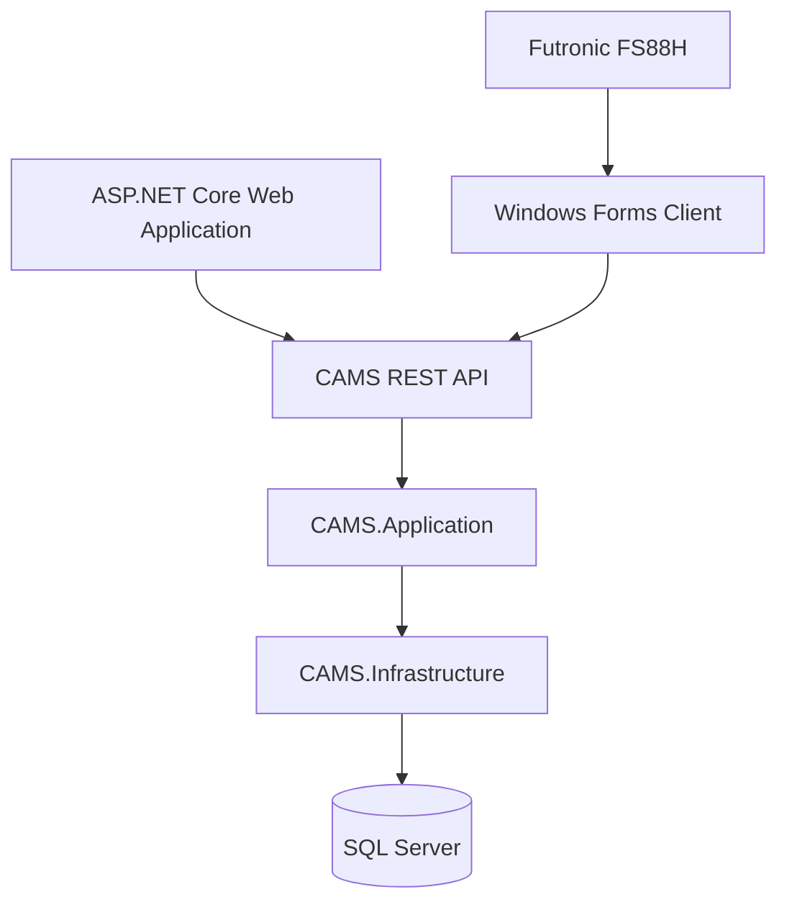

# CAMS — Church Attendance Management System

CAMS is a full-stack **Church Attendance Management System** built with **.NET 10, ASP.NET Core, Entity Framework Core, SQL Server, Windows Forms, and SignalR**.

The system manages church members, events, registrations, and attendance through multiple attendance methods including:

- QR Code
- Manual Attendance
- Fingerprint Identification

It consists of a web application for administration and member-facing functionality, together with a Windows desktop application for on-site attendance and fingerprint scanner integration.

> This repository is published as part of my software engineering portfolio to demonstrate my experience with .NET, backend development, REST APIs, Entity Framework Core, SQL Server, Windows Forms, real-time communication, and hardware SDK integration.

---

## Overview

CAMS was designed to centralize member and attendance management while keeping business rules on the server.

The web and desktop applications communicate through authenticated HTTP APIs rather than accessing the database directly.

```text
Web Application
      │
      │
      ▼
   CAMS API
      │
      ▼
Application Layer
      │
      ▼
Infrastructure
      │
      ▼
  SQL Server


Windows Forms Client
      │
      ├── CAMS API
      │
      └── Futronic FS88H
```

This allows attendance validation and business rules to remain consistent regardless of whether attendance is recorded through QR code, fingerprint, or manual entry.

---

# Features

## Member Management

- Member registration
- Administrative registration approval
- Member profile management
- Active/inactive member status
- Mobile number management
- Role-based access
- Member fingerprint enrollment

---

## Event Management

- Create and manage church events
- Configure event dates
- Configure attendance periods
- Separate time-in and time-out windows
- Support regular and special events
- Event-specific attendance records

---

## Attendance Management

CAMS supports multiple attendance methods:

- QR Code
- Fingerprint
- Manual Attendance

All attendance methods eventually use a common server-side workflow.

```text
QR Code
     \
      \
Fingerprint ───► Common Attendance Workflow
      /
     /
Manual
```

The server validates:

- Member existence
- Member active status
- Event existence
- Attendance window
- Existing attendance records
- Duplicate time-ins
- Time-out eligibility
- Attendance method
- Attendance action

Attendance timestamps are persisted consistently by the backend rather than relying on the client machine.

---

# QR Attendance

Events can use QR-based attendance sessions.

The system validates:

- QR token validity
- QR expiration
- Event association
- Attendance action
- Attendance window
- Member eligibility

Example flow:

```text
Member scans QR
      ↓
CAMS API
      ↓
Validate QR session
      ↓
Validate attendance rules
      ↓
Record attendance
```

---

# Fingerprint Attendance

CAMS integrates with a **Futronic FS88H fingerprint scanner** using the Futronic SDK.

The biometric functionality is handled by the Windows Forms application.

## Fingerprint Enrollment

```text
Member selected
      ↓
Fingerprint Enrollment
      ↓
Futronic FS88H
      ↓
Fingerprint Template
      ↓
CAMS API
      ↓
Template Protection
      ↓
SQL Server
```

The system stores the fingerprint template generated by the SDK rather than a fingerprint image.

A fingerprint record contains information such as:

```text
MemberFingerprint
├── Id
├── MemberId
├── ProtectedTemplate
├── FingerLabel
└── IsActive
```

Supported finger labels can include:

```text
Right Thumb
Right Index
Right Middle
Right Ring
Right Little

Left Thumb
Left Index
Left Middle
Left Ring
Left Little
```

Fingerprint templates are protected before being persisted.

---

## Fingerprint Identification

During attendance, the desktop client performs fingerprint identification using enrolled templates.

```text
Finger placed on scanner
      ↓
Futronic FS88H
      ↓
Fingerprint Identification
      ↓
Matched Member ID
      ↓
CAMS Attendance API
      ↓
Server-side Validation
      ↓
Attendance Recorded
```

The biometric SDK is responsible for fingerprint matching.

The CAMS server remains responsible for attendance rules and persistence.

---

# Real-Time Attendance

CAMS uses **SignalR** to support real-time attendance updates.

When an attendance record is created, connected clients can receive updates without requiring a full page refresh.

This is useful for:

- Live attendance monitoring
- Administrative attendance views
- Event attendance displays

---

# Architecture

The solution follows a layered structure.

```text
CAMS.sln
│
├── CAMS.Domain
│   ├── Entities
│   ├── Enums
│   └── Core domain models
│
├── CAMS.Application
│   ├── Services
│   ├── DTOs
│   ├── Interfaces
│   ├── Validation
│   └── Business rules
│
├── CAMS.Infrastructure
│   ├── Entity Framework Core
│   ├── Repositories
│   ├── Database access
│   └── Infrastructure services
│
├── CAMS.Web
│   ├── ASP.NET Core MVC
│   ├── REST APIs
│   ├── Administration
│   ├── Member portal
│   └── SignalR
│
├── CAMS.Winforms
│   ├── Desktop attendance client
│   ├── API communication
│   ├── Fingerprint enrollment
│   ├── Fingerprint identification
│   └── Futronic integration
│
└── ThirdParty
    └── Futronic integration components
```

---

# Application Architecture



The Windows Forms application does not connect directly to SQL Server.

Instead:

```text
CAMS.Winforms
      ↓
Authenticated HTTPS
      ↓
CAMS REST API
      ↓
Application Services
      ↓
Repositories
      ↓
SQL Server
```

---

# Fingerprint Abstractions

Fingerprint functionality is isolated behind application-specific interfaces.

```text
IFingerprintScanner
      │
      └── FutronicFingerprintScanner
              ↓
         Identification
```

```text
IFingerprintEnroller
      │
      └── FutronicFingerprintEnroller
              ↓
          Enrollment
```

This reduces direct SDK dependencies throughout the Windows Forms application and keeps hardware-specific behavior isolated.

---

# Technology Stack

## Backend

- .NET 10
- ASP.NET Core
- ASP.NET Core MVC
- REST API
- Entity Framework Core 10
- SQL Server
- SignalR
- ASP.NET Core Data Protection

## Web Frontend

- Razor Views
- JavaScript
- Bootstrap
- HTML
- CSS

## Desktop

- .NET 10 Windows Forms
- HttpClient
- Cookie-based authentication
- Futronic SDK
- Futronic FS88H

## Database

- Microsoft SQL Server
- Entity Framework Core Migrations

---

# API Communication

The Windows Forms application uses a dedicated API client.

```text
Login
   ↓
Authentication Cookie
   ↓
CamsApiClient
   ↓
Event API
Attendance API
Member API
Fingerprint API
```

The authenticated session is maintained using a `CookieContainer`.

The desktop application therefore does not need direct access to database credentials.

---

# API Examples

## Event Attendance

```http
GET /api/v1/attendance/event/{eventId}
```

---

## Manual Attendance

```http
POST /api/v1/attendance/manual
```

Example:

```json
{
  "eventId": "00000000-0000-0000-0000-000000000000",
  "memberId": "00000000-0000-0000-0000-000000000000",
  "action": 0
}
```

---

## Fingerprint Attendance

```http
POST /api/v1/attendance/fingerprint
```

---

## Fingerprint Enrollment

```http
POST /api/v1/member/{memberId}/fingerprint
```

Example:

```json
{
  "template": "<base64 fingerprint template>",
  "fingerLabel": "Right Thumb"
}
```

---

# API Response Format

CAMS uses a consistent API response envelope.

Example:

```json
{
  "success": true,
  "message": "Fingerprint enrolled successfully.",
  "data": {
    "id": "00000000-0000-0000-0000-000000000000",
    "memberId": "00000000-0000-0000-0000-000000000000",
    "fingerLabel": "Right Thumb",
    "isActive": true
  }
}
```

---

# Security Considerations

CAMS keeps important validation and security responsibilities on the server.

Some design considerations include:

- Authenticated API access
- Role-based authorization
- Server-side attendance validation
- No direct SQL Server access from the desktop client
- Protected fingerprint templates
- Expiring QR sessions
- Centralized exception handling
- Restricted biometric endpoints
- Biometric templates excluded from normal member responses

Fingerprint templates are treated as sensitive data and should only be accessible to authorized application components.

---

# Data Protection

Fingerprint templates are protected before being stored in SQL Server.

In production, the ASP.NET Core Data Protection key ring should be persisted so protected fingerprint templates remain decryptable after redeployments or application restarts.

A production backup strategy should therefore include both:

```text
SQL Server Database

+

Data Protection Key Ring
```

Data Protection keys should never be committed to source control.

---

# Getting Started

## Requirements

Install:

- .NET 10 SDK
- Visual Studio with .NET desktop and ASP.NET Core development tools
- Microsoft SQL Server
- SQL Server Management Studio or another SQL client

Fingerprint functionality additionally requires:

- Futronic FS88H or compatible fingerprint scanner
- Futronic SDK
- Required Futronic runtime libraries

---

## Clone

```bash
git clone https://github.com/stevemeister05/CAMS.git
```

```bash
cd CAMS
```

---

# Database Setup

Configure the database connection in your local application configuration.

Example:

```json
{
  "ConnectionStrings": {
    "DefaultConnection": "YOUR_CONNECTION_STRING"
  }
}
```

Do not commit real production credentials.

Apply the database migrations using Visual Studio Package Manager Console:

```powershell
Update-Database
```

or using the .NET CLI:

```bash
dotnet ef database update \
    --project CAMS.Infrastructure \
    --startup-project CAMS.Web
```

---

# Run the Web Application

Set the web project as the startup project and run it through Visual Studio.

Alternatively:

```bash
dotnet run --project CAMS.Web
```

---

# Windows Forms Configuration

The desktop application communicates with the CAMS server through HTTPS.

Configure the API address in the local WinForms configuration.

Example:

```json
{
  "ApiBaseUrl": "https://localhost:5001"
}
```

Use the URL and port configured for your local web application.

---

# Futronic Setup

Fingerprint functionality requires the Futronic SDK.

The current desktop integration targets:

```text
x64
```

Native Futronic libraries must be available to the Windows Forms application at runtime.

Example output:

```text
CAMS.Winforms
└── bin
    └── Debug
        └── net10.0-windows
            ├── CAMS.Winforms.exe
            ├── FTRAPI.dll
            └── ftrScanAPI.dll
```

Third-party SDK binaries may be excluded from this public repository because they remain subject to their vendor's licensing and redistribution terms.

Developers who want to enable fingerprint functionality may need to obtain the Futronic SDK separately.

---

# Current Development Status

## Implemented

- Layered .NET architecture
- Member management
- Member registration
- Registration approval
- Event management
- Attendance management
- QR attendance
- Manual attendance
- Common attendance validation
- Time-in and time-out workflow
- REST API integration
- Cookie-based WinForms authentication
- SignalR attendance notifications
- Windows Forms attendance client
- Futronic SDK integration
- Futronic FS88H communication
- Fingerprint database architecture
- Fingerprint template protection
- Fingerprint enrollment backend
- Fingerprint enrollment client infrastructure

## In Progress

- Fingerprint enrollment user interface
- Fingerprint attendance identification workflow
- Continuous fingerprint attendance scanning
- Fingerprint management interface
- Additional Windows Forms usability improvements

---

# Planned Improvements

Future improvements include:

- Complete fingerprint enrollment workflow
- Continuous fingerprint identification
- Multiple fingerprint management per member
- Fingerprint replacement and deactivation
- Attendance reporting
- Audit logging
- Dashboard enhancements
- Additional automated tests
- Deployment documentation
- Improved desktop user experience

---

# Screenshots

Screenshots will be added as the UI is finalized.

Planned screenshots include:

- Admin Dashboard
- Member Management
- Event Management
- Event Attendance
- QR Attendance
- Windows Forms Attendance Client
- Fingerprint Enrollment

---

# What This Project Demonstrates

CAMS is primarily a practical software engineering project demonstrating experience in:

- C#
- .NET
- ASP.NET Core
- REST API design
- Entity Framework Core
- SQL Server
- Repository and Unit of Work patterns
- Authentication and authorization
- Server-side business rules
- Windows Forms
- Web and desktop integration
- SignalR
- Hardware SDK integration
- Biometric fingerprint processing
- Secure handling of sensitive data
- Multi-project solution architecture

---

# Repository Notes

This public repository is intended primarily for **portfolio and demonstration purposes**.

Before publishing, sensitive or environment-specific files should be excluded, including:

```text
Production configuration
Connection strings
Passwords
Certificates
Private keys
Data Protection keys
Database backups
Real member information
Real fingerprint templates
Vendor SDK files that cannot be redistributed
```

Example configuration files may be included with placeholder values where appropriate.

---

# Third-Party Components

This project integrates with third-party software and SDKs, including the Futronic fingerprint SDK.

Third-party software, binaries, source code, documentation, and libraries remain subject to their respective licenses and terms.

The presence of integration code in this repository does not grant rights to redistribute or use third-party proprietary components.

---

# Author

**Steven Rufe C. Padolina**

Senior .NET Developer

Technical focus:

- C# / .NET
- ASP.NET Core
- Entity Framework Core
- REST APIs
- SQL Server
- JavaScript / TypeScript
- Windows Forms
- System Integration

LinkedIn:

https://linkedin.com/in/stevemeister05

---

# Source Code Notice

This repository is publicly available for **portfolio and demonstration purposes**.

Copyright © 2026 Steven Rufe C. Padolina. All rights reserved.

Unless otherwise stated, no license is granted for copying, modifying, redistributing, or commercially using the source code.

Third-party libraries, SDKs, and components remain subject to their respective licenses.
